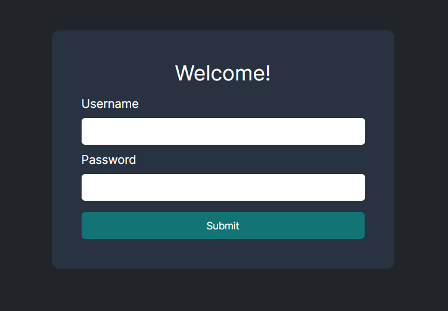
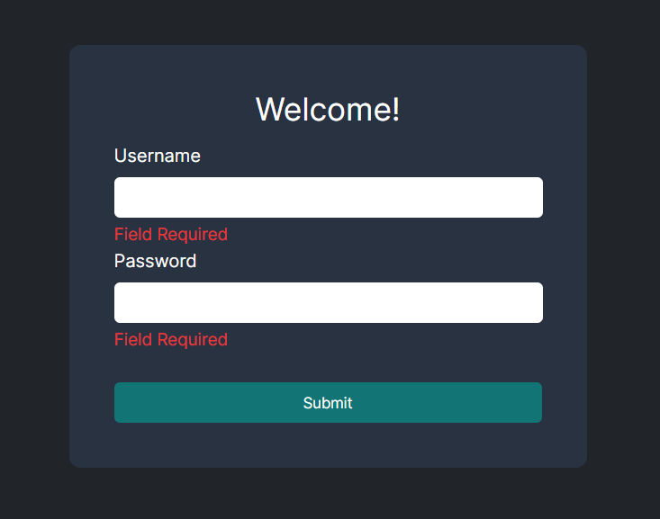
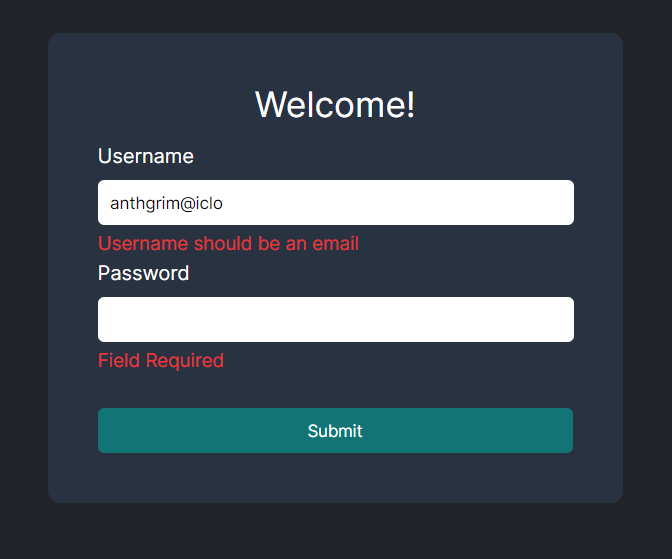
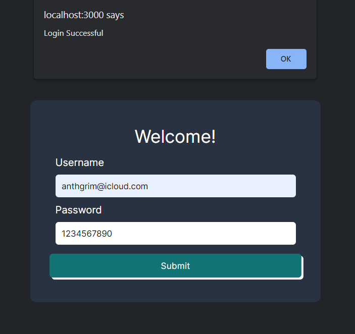

# Login Form Coding Challenge

## Description
This is the login form coding challenge from MIT/xPro Fullstack Development with MERN Bootcamp. It consist on creating a form using React JS and Formik to add simple form validations. 

## Goal 
To create a form with Usarname and Password Field, as well for a submit button. The form should implement the following input validation rules:

- If the username or password inputs are empty, display the message "field required" under the text input.
- If the username is not in an email format, display the message "username should be an email" under the text input.
- If the username and password pass the validation above, then display the message "Login Successful" in an `alert` box.

## Extras
- Custom styles

## Future Adds

- To hide password in UI
- Add basic animations when login succesfully, besides the alert. 

## Final 

## Author
Kevin Grimaldi - Student at MIT Bootcamp